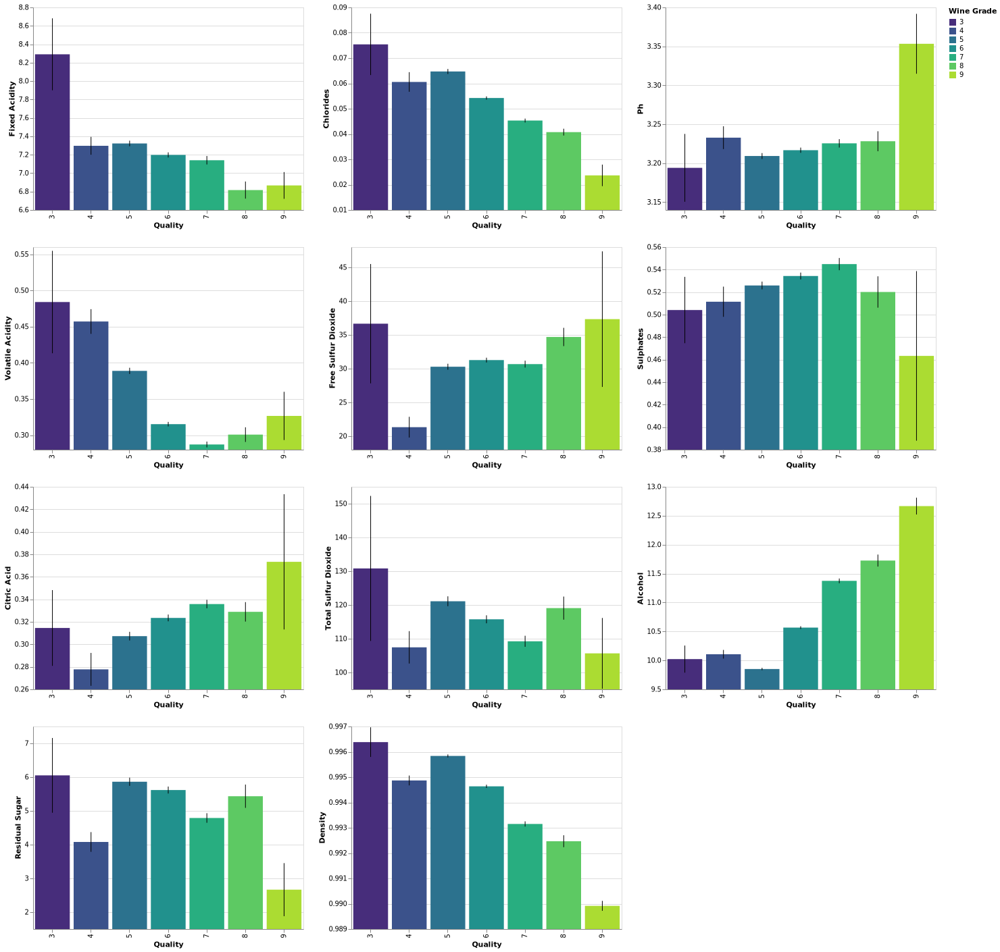
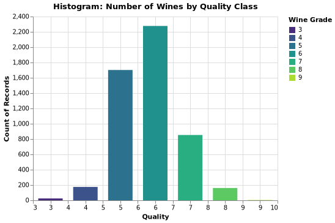
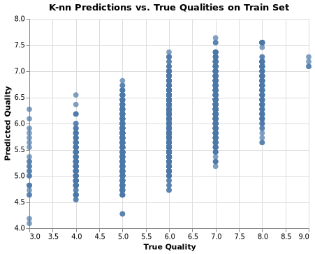

```{r setup, include=FALSE}
knitr::opts_chunk$set(echo = FALSE, fig.align = "center")
library(knitr)
library(dplyr)
library(readr)
```

# Summary

With the wine quality data, we are attempting to build a regression model to help us identify the best white and white variants of the Portuguese "Vinho Verde" wine. We plan to build a predictive regression model that can effectively predict the wine quality score given the physicochemical tests variable. 

Our final regression model- the k-nearest neighbors (k-NN) regressor performs fairly well on an unseen test data set, with an RMSE score of 0.7171. 

A lower value of RMSE indicates a better fit and it is a good measure of how accurate our model predicts the response. From our result, our RMSE score for the test set is pretty similar to the RMSE score for the validation set. There is no overfitting nor underfitting problems in our model.

We selected the k-NN regressor as our final model after making a comparison with the baseline model, dummy regressor and the ridge regressor based on the mean cross-validation RMSE score with hyperparameter tuning. We then used the best-tuned hyperparameter, k= 16 for k-NN regressor and alpha=10 for ridge regressor to obtain an overall RME score for our training set. We can see that it is obvious the k-NN regressor has a lower RMSE score compared to other models. 

```{r}
kable(read.csv(file = '../results/model_comparison.csv') %>% mutate_if(is.numeric, round, 3), caption = 'Table 1: RMSE Score for All Models Training Set')

```

The model we obtained may not be the best model to be used in the industry to predict the wine quality score since there are still spaces for improvement to reduce the RMSE score. Thus we recommend continuing study to improve this prediction model before we use this in production. 


# Introduction

As wine tasting is gaining increasing popularity, more efficient and lower-cost wine quality assessments are of urgent interest for the wine industry to support the growing consumption. Wine certification is an essential issue within such context and quality assessment is the key component of certification. Wine quality is generally determined by two types of tests: physiochemical (e.g. pH) tests and sensory (e.g. wine expert assessments) tests [@ebeler1999linking]. The relationship between chemical composition and human taste preferences is complex and not explicitly known [@legin2003evaluation]. Wine quality assurance still relies heavily on human expertise, thus time-consuming and expensive. 

Researchers have explored the usage of machine learning techniques to assess wine quality, but still a great scope for improvement. Here we ask if we can use a machine learning algorithm to predict the quality of wine based on the physiochemical features. If a machine learning algorithm can successfully predict and quantify complex human sensory evaluation scores, such assessment could lead to more cost-efficient and accurate certification for wine quality assurance.

# Methods

## Data

The data sets used in this project are of the prediction of wine quality
based on physicochemical tests, related to red and white vinho verde
wine samples, from the north of Portugal. The data were created by Paulo
Cortez et al at the University of Minho, Guimarães, Portugal (2009). It
was sourced from the UCI Machine Learning Repository (Dua and Graff
2017) and can be found
[here](https://archive.ics.uci.edu/ml/datasets/Wine+Quality),
specifically this
[file](https://archive.ics.uci.edu/ml/machine-learning-databases/wine-quality/).
The data provided only have physicochemical (inputs) and sensory (the
output) variables available (e.g. there is no data about grape types,
wine brand, wine selling price, etc.). There are a total of 4898
instances in our combined dataset of red wine and white wine.

## Analysis

The k-nearest neighbors (k-NN) algorithm and linear regression (Ridge) were used to build regression models to predict wine quality (found in the quality column of the data set). Not only that, but we also include a dummy regressor model for baseline comparison. The mean strategy was chosen to generate predictions. We used all variables in the original data set to fit the model and carried out cross-validation. After carrying out parameter tuning together with cross-validation, we chose 16 for hyperparameter k of k-NN algorithm and 10 for the alpha of Ridge. The R [@R] and Python [@Python] programming languages and the following R and Python packages were used to perform the analysis: tidyverse [@tidyverse], knitr [@knitr], docopt [@docopt], numpy [@harris2020array], Pandas [@mckinney2010data], altair [@2018-altair], scikit-learn [@scikit-learn], dplyr[@dplyr]. The code used to perform the analysis and create this report can be found here: https://github.com/UBC-MDS/DSCI522_Team_23.


# Results & Discussion

To look at our distributions of the dataset, we started by plotting histograms and error bars for all our variables. We hope to find if there is any pattern or trends in our data. Most of our variables are evenly distributed across all our response variables (quality). However, there are some variables that actually show some distinction. From Figure 1, we can actually see that as the alcohol value, pH, and citric acid increases, we tend to have a better wine quality. On the other hand, the quality score tends to increase gradually when fixed acidity, chlorides and density decreases. We did not choose to omit any variables in our preliminary analysis as we think that all features that consist of our data play an important role in quality prediction.


```{r, fig.cap= "Figure 1. All Variables vs Quality", out.width='100%'}

```

Also, we plotted the number of wines by quality class to observe the range of quality score in our data. From Figure 2, we can see that most of our wine grade centers around 5 to 7. 

```{r, fig.cap= "Figure 2. Number of Wines by Quality Class", out.width='50%'}

```


We chose to use a simple regression model using the k-nearest neighbors' algorithm together with ridge regressor and dummy regressor for predictions. To find the model that best predicted the wine quality score, we performed the default 5-fold cross-validation to find the best k and best alpha for our prediction model. From table 3 and 4, we observed the best optimal k was 16, with a validation RMSE of 0.698 and the best alpha value is 10, with a validation RMSE of 0.731. 


```{r}
kable(read.csv(file = '../results/knn_results.csv'), caption = 'Table 2: Cross-validation RMSE Score for kNN')
```

```{r}
kable(read.csv(file = '../results/ridge_results.csv'), caption = 'Table 3: Cross-validation RMSE Score for Ridge Regressor')
```

By comparing the best validation RMSE score among our models, we can see that the baseline model, dummy regressor performs the worst, followed by ridge regression and kNN regressor. 

```{r, message = FALSE}
kable(read_csv(file = '../results/dummy_results.csv', col_names = c('Dummy Regressor', 'RMSE value'))[-1,], caption = 'Table 4: Cross-validation RMSE Score for Dummy Regressor')
```

We also compare the actual vs prediction score values for our validation set on the kNN and Ridge models. From here, we can see that the predicted quality falls within the range of 4 to 8, which are reasonable values. One of our concerns when performing regression on our data was the predictions fall out of our quality score range, which is between 0-10. 

```{r, fig.cap= "Figure 3. Ridge Predictions vs Actual", out.width='50%'}
knitr::include_graphics("../results/ridge_prediction.png")
```

```{r, fig.cap= "Figure 4. KNN Predictions vs Actual", out.width='50%'}

```

We then used our selected model with k=16 to perform predictions on our test set. 

```{r}
kable(read.csv(file = '../results/test_set_result.csv'), caption = 'Table 5: RMSE Score for Test Sset')
```


Our prediction model performed quite well on test data, with an RMSE score of 0.7171 for the test set, which is pretty similar to our validation score of the KNN regressor. 

There are a few suggestions to improve our model. First, we could try more power regression models such as Random Forests Algorithm. Also, given a relatively small number of features in the dataset, we could use forward selection to reduce the number of features. We could also engineer new features. One possible feature is the percentage of molecular sulphur dioxide which is the active form that acts as germicide and antioxidant in winemaking and is potentially associated with wine quality. The percentage of molecular sulphur dioxide can be calculated with the concentration of free SO2 and the pH [@sudraud1985anti].


# References


