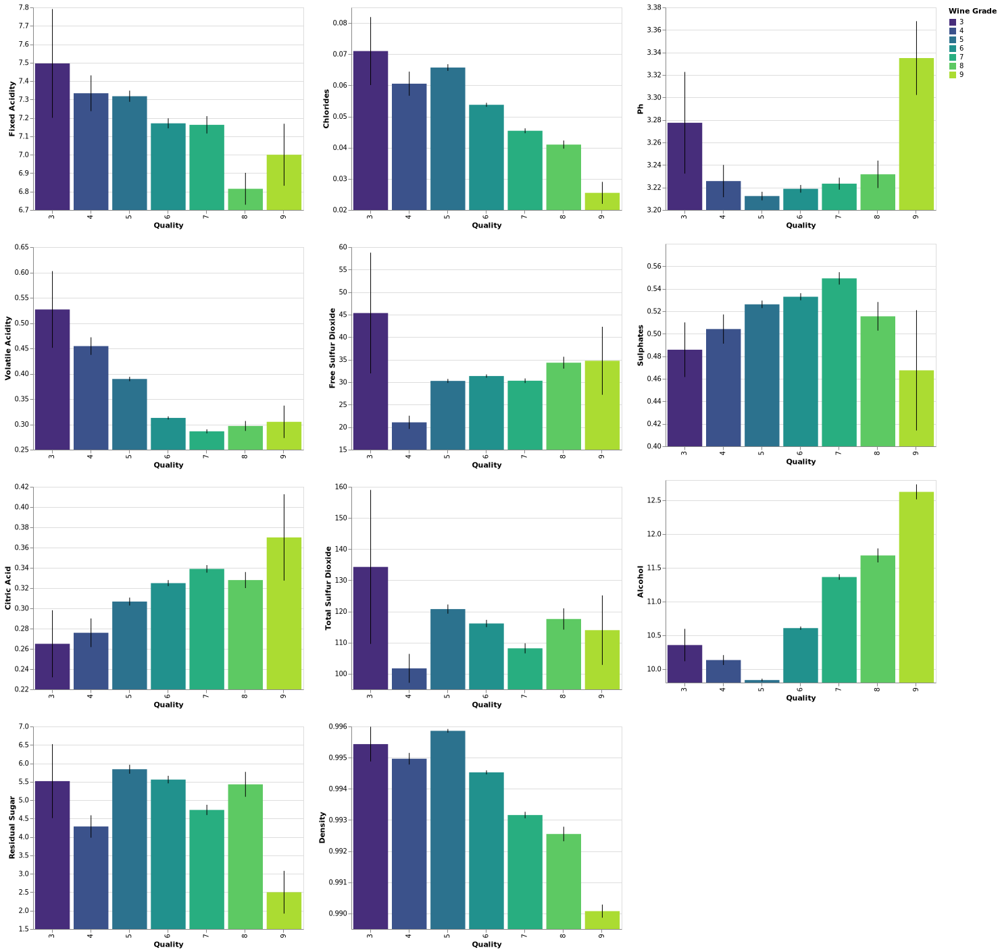
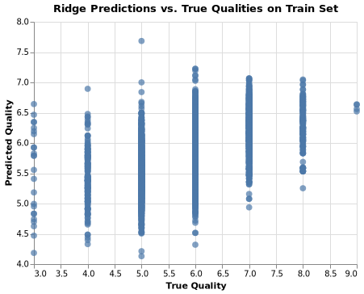

-   [Summary](#summary)
-   [Introduction](#introduction)
-   [Methods](#methods)
    -   [Data](#data)
    -   [Analysis](#analysis)
-   [Results & Discussion](#results-discussion)
-   [References](#references)

Summary
=======

With the wine quality data, we are attempting to build a regression
model to help us identify the best white and white variants of the
Portuguese “Vinho Verde” wine. We plan to build a predictive regression
model that can effectively predict the wine quality score given the
physicochemical tests variable.

Our final regression model- the k-nearest neighbors (k-NN) regressor
performs fairly well on an unseen test data set, with an RMSE score of
0.7171.

A lower value of RMSE indicates a better fit and it is a good measure of
how accurate our model predicts the response. From our result, our RMSE
score for the test set is pretty similar to the RMSE score for the
validation set. There is no overfitting nor underfitting problems in our
model.

We selected the k-NN regressor as our final model after making a
comparison with the baseline model, dummy regressor and the ridge
regressor based on the mean cross-validation RMSE score with
hyperparameter tuning. We then used the best-tuned hyperparameter, k= 16
for k-NN regressor and alpha=10 for ridge regressor to obtain an overall
RME score for our training set. We can see that it is obvious the k-NN
regressor has a lower RMSE score compared to other models.

<table>
<caption>Table 1: RMSE Score for All Models Training Set</caption>
<thead>
<tr class="header">
<th style="text-align: left;">Model</th>
<th style="text-align: right;">RMSE.on.train.set</th>
</tr>
</thead>
<tbody>
<tr class="odd">
<td style="text-align: left;">dummy_regressor</td>
<td style="text-align: right;">0.868</td>
</tr>
<tr class="even">
<td style="text-align: left;">Ridge_regressor</td>
<td style="text-align: right;">0.728</td>
</tr>
<tr class="odd">
<td style="text-align: left;">K-nn_Regressor</td>
<td style="text-align: right;">0.650</td>
</tr>
</tbody>
</table>

The model we obtained may not be the best model to be used in the
industry to predict the wine quality score since there are still spaces
for improvement to reduce the RMSE score. Thus we recommend continuing
study to improve this prediction model before we use this in production.

Introduction
============

As wine tasting is gaining increasing popularity, more efficient and
lower-cost wine quality assessments are of urgent interest for the wine
industry to support the growing consumption. Wine certification is an
essential issue within such context and quality assessment is the key
component of certification. Wine quality is generally determined by two
types of tests: physiochemical (e.g. pH) tests and sensory (e.g. wine
expert assessments) tests (Ebeler 1999). The relationship between
chemical composition and human taste preferences is complex and not
explicitly known (Legin et al. 2003). Wine quality assurance still
relies heavily on human expertise, thus time-consuming and expensive.

Researchers have explored the usage of machine learning techniques to
assess wine quality, but still a great scope for improvement. Here we
ask if we can use a machine learning algorithm to predict the quality of
wine based on the physiochemical features. If a machine learning
algorithm can successfully predict and quantify complex human sensory
evaluation scores, such assessment could lead to more cost-efficient and
accurate certification for wine quality assurance.

Methods
=======

Data
----

The data sets used in this project are of the prediction of wine quality
based on physicochemical tests, related to red and white vinho verde
wine samples, from the north of Portugal. The data were created by Paulo
Cortez et al at the University of Minho, Guimarães, Portugal (2009). It
was sourced from the UCI Machine Learning Repository (Dua and Graff
2017) and can be found
[here](https://archive.ics.uci.edu/ml/datasets/Wine+Quality),
specifically this
[file](https://archive.ics.uci.edu/ml/machine-learning-databases/wine-quality/).
The data provided only have physicochemical (inputs) and sensory (the
output) variables available (e.g. there is no data about grape types,
wine brand, wine selling price, etc.). There are a total of 4898
instances in our combined dataset of red wine and white wine.

Analysis
--------

The k-nearest neighbors (k-NN) algorithm and linear regression (Ridge)
were used to build regression models to predict wine quality (found in
the quality column of the data set). Not only that, but we also include
a dummy regressor model for baseline comparison. The mean strategy was
chosen to generate predictions. We used all variables in the original
data set to fit the model and carried out cross-validation. After
carrying out parameter tuning together with cross-validation, we chose
16 for hyperparameter k of k-NN algorithm and 10 for the alpha of Ridge.
The R (R Core Team 2020) and Python (Van Rossum and Drake 2009)
programming languages and the following R and Python packages were used
to perform the analysis: tidyverse (Wickham et al. 2019), knitr (Xie
2020), docopt (de Jonge 2020), numpy (Harris et al. 2020), Pandas
(McKinney and others 2010), altair (Sievert 2018), scikit-learn
(Pedregosa et al. 2011), dplyr (Wickham et al. 2020), readr (Wickham and
Hester 2020). The code used to perform the analysis and create this
report can be found here:
<a href="https://github.com/UBC-MDS/DSCI522_Team_23" class="uri">https://github.com/UBC-MDS/DSCI522_Team_23</a>.

Results & Discussion
====================

To look at our distributions of the dataset, we started by plotting
histograms and error bars for all our variables. We hope to find if
there is any pattern or trends in our data. Most of our variables are
evenly distributed across all our response variables (quality). However,
there are some variables that actually show some distinction. From
Figure 1, we can actually see that as the alcohol value, pH, and citric
acid increases, we tend to have a better wine quality. On the other
hand, the quality score tends to increase gradually when fixed acidity,
chlorides and density decreases. We did not choose to omit any variables
in our preliminary analysis as we think that all features that consist
of our data play an important role in quality prediction.

Figure 1. All Variables vs Quality

Also, we plotted the number of wines by quality class to observe the
range of quality score in our data. From Figure 2, we can see that most
of our wine grade centers around 5 to 7.

Figure 2. Number of Wines by Quality Class

We chose to use a simple regression model using the k-nearest neighbors’
algorithm, ridge regressor and dummy regressor for predictions. To find
the model that best predicted the wine quality score, we performed the
default 5-fold cross-validation to find the best k and best alpha for
our prediction model. From table 3 and 4, we observed the best optimal k
was 16, with a validation RMSE of 0.698 and the best alpha value is 10,
with a validation RMSE of 0.731.

<table style="width:100%;">
<caption>Table 2: Cross-validation RMSE Score for kNN</caption>
<colgroup>
<col style="width: 30%" />
<col style="width: 37%" />
<col style="width: 17%" />
<col style="width: 14%" />
</colgroup>
<thead>
<tr class="header">
<th style="text-align: right;">mean_train_negative_RMSE</th>
<th style="text-align: right;">mean_validation_negative_RMSE</th>
<th style="text-align: right;">rank_cv_score</th>
<th style="text-align: right;">n_neighbors</th>
</tr>
</thead>
<tbody>
<tr class="odd">
<td style="text-align: right;">-0.6551716</td>
<td style="text-align: right;">-0.6984427</td>
<td style="text-align: right;">1</td>
<td style="text-align: right;">16</td>
</tr>
<tr class="even">
<td style="text-align: right;">-0.6352172</td>
<td style="text-align: right;">-0.6995469</td>
<td style="text-align: right;">2</td>
<td style="text-align: right;">11</td>
</tr>
<tr class="odd">
<td style="text-align: right;">-0.5840706</td>
<td style="text-align: right;">-0.7000658</td>
<td style="text-align: right;">3</td>
<td style="text-align: right;">6</td>
</tr>
<tr class="even">
<td style="text-align: right;">-0.6671866</td>
<td style="text-align: right;">-0.7020857</td>
<td style="text-align: right;">4</td>
<td style="text-align: right;">21</td>
</tr>
<tr class="odd">
<td style="text-align: right;">-0.6737504</td>
<td style="text-align: right;">-0.7024079</td>
<td style="text-align: right;">5</td>
<td style="text-align: right;">26</td>
</tr>
<tr class="even">
<td style="text-align: right;">-0.6792406</td>
<td style="text-align: right;">-0.7033041</td>
<td style="text-align: right;">6</td>
<td style="text-align: right;">31</td>
</tr>
<tr class="odd">
<td style="text-align: right;">-0.6834496</td>
<td style="text-align: right;">-0.7035746</td>
<td style="text-align: right;">7</td>
<td style="text-align: right;">36</td>
</tr>
<tr class="even">
<td style="text-align: right;">-0.6857130</td>
<td style="text-align: right;">-0.7035957</td>
<td style="text-align: right;">8</td>
<td style="text-align: right;">41</td>
</tr>
<tr class="odd">
<td style="text-align: right;">-0.6882499</td>
<td style="text-align: right;">-0.7041832</td>
<td style="text-align: right;">9</td>
<td style="text-align: right;">46</td>
</tr>
<tr class="even">
<td style="text-align: right;">0.0000000</td>
<td style="text-align: right;">-0.7907265</td>
<td style="text-align: right;">10</td>
<td style="text-align: right;">1</td>
</tr>
</tbody>
</table>

<table>
<caption>Table 3: Cross-validation RMSE Score for Ridge Regressor</caption>
<thead>
<tr class="header">
<th style="text-align: right;">mean_train_negative_RMSE</th>
<th style="text-align: right;">mean_validation_negative_RMSE</th>
<th style="text-align: right;">rank_cv_score</th>
<th style="text-align: right;">alpha</th>
</tr>
</thead>
<tbody>
<tr class="odd">
<td style="text-align: right;">-0.7281132</td>
<td style="text-align: right;">-0.7306637</td>
<td style="text-align: right;">1</td>
<td style="text-align: right;">1e+01</td>
</tr>
<tr class="even">
<td style="text-align: right;">-0.7280708</td>
<td style="text-align: right;">-0.7307792</td>
<td style="text-align: right;">2</td>
<td style="text-align: right;">1e+00</td>
</tr>
<tr class="odd">
<td style="text-align: right;">-0.7280702</td>
<td style="text-align: right;">-0.7307984</td>
<td style="text-align: right;">3</td>
<td style="text-align: right;">1e-01</td>
</tr>
<tr class="even">
<td style="text-align: right;">-0.7280702</td>
<td style="text-align: right;">-0.7308004</td>
<td style="text-align: right;">4</td>
<td style="text-align: right;">1e-02</td>
</tr>
<tr class="odd">
<td style="text-align: right;">-0.7280702</td>
<td style="text-align: right;">-0.7308006</td>
<td style="text-align: right;">5</td>
<td style="text-align: right;">1e-03</td>
</tr>
<tr class="even">
<td style="text-align: right;">-0.7291403</td>
<td style="text-align: right;">-0.7312388</td>
<td style="text-align: right;">6</td>
<td style="text-align: right;">1e+02</td>
</tr>
<tr class="odd">
<td style="text-align: right;">-0.7381478</td>
<td style="text-align: right;">-0.7396998</td>
<td style="text-align: right;">7</td>
<td style="text-align: right;">1e+03</td>
</tr>
</tbody>
</table>

By comparing the best validation RMSE scores among our models, we can
see that the baseline model, dummy regressor performs the worst,
followed by ridge regression and kNN regressor.

<table>
<caption>Table 4: Cross-validation RMSE Score for Dummy Regressor</caption>
<thead>
<tr class="header">
<th style="text-align: left;">Dummy Regressor</th>
<th style="text-align: right;">RMSE value</th>
</tr>
</thead>
<tbody>
<tr class="odd">
<td style="text-align: left;">mean_train_negative_RMSE</td>
<td style="text-align: right;">-0.8681328</td>
</tr>
<tr class="even">
<td style="text-align: left;">mean_validation_negative_RMSE</td>
<td style="text-align: right;">-0.8682200</td>
</tr>
</tbody>
</table>

We also compare the actual vs prediction score values for our validation
set on the kNN and Ridge models. From here, we can see that the
predicted quality falls within the range of 4 to 8, which are reasonable
values. One of our concerns when performing regression on our data was
the predictions fell out of our quality score range, which is between
0-10.

Figure 3. Ridge Predictions vs Actual

Figure 4. KNN Predictions vs Actual

We then used our selected model with k=16 to perform predictions on our
test set.

<table>
<caption>Table 5: RMSE Score for Test Sset</caption>
<thead>
<tr class="header">
<th style="text-align: left;">Model</th>
<th style="text-align: right;">test_split_RMSE</th>
</tr>
</thead>
<tbody>
<tr class="odd">
<td style="text-align: left;">k-NN</td>
<td style="text-align: right;">0.7170968</td>
</tr>
</tbody>
</table>

Our prediction model performed quite well on test data, with an RMSE
score of 0.7171 , which is pretty similar to our validation score of the
KNN regressor.

There are a few suggestions to improve our model. First, we could try
more power regression models such as Random Forests Algorithm. Also,
given a relatively small number of features in the dataset, we could use
forward selection to reduce the number of features. We could also
engineer new features. One possible feature is the percentage of
molecular sulphur dioxide which is the active form that acts as
germicide and antioxidant in winemaking and is potentially associated
with wine quality. The percentage of molecular sulphur dioxide can be
calculated with the concentration of free SO2 and the pH (Sudraud and
Chauvet 1985).

References
==========

de Jonge, Edwin. 2020. *Docopt: Command-Line Interface Specification
Language*. <https://CRAN.R-project.org/package=docopt>.

Ebeler, Susan E. 1999. “Linking Flavor Chemistry to Sensory Analysis of
Wine.” In *Flavor Chemistry*, 409–21. Springer.

Harris, Charles R., K. Jarrod Millman, St’efan J. van der Walt, Ralf
Gommers, Pauli Virtanen, David Cournapeau, Eric Wieser, et al. 2020.
“Array Programming with NumPy.” *Nature* 585 (7825): 357–62.
<https://doi.org/10.1038/s41586-020-2649-2>.

Legin, A, A Rudnitskaya, L Lvova, Yu Vlasov, C Di Natale, and A D’amico.
2003. “Evaluation of Italian Wine by the Electronic Tongue: Recognition,
Quantitative Analysis and Correlation with Human Sensory Perception.”
*Analytica Chimica Acta* 484 (1): 33–44.

McKinney, Wes, and others. 2010. “Data Structures for Statistical
Computing in Python.” In *Proceedings of the 9th Python in Science
Conference*, 445:51–56. Austin, TX.

Pedregosa, F., G. Varoquaux, A. Gramfort, V. Michel, B. Thirion, O.
Grisel, M. Blondel, et al. 2011. “Scikit-Learn: Machine Learning in
Python.” *Journal of Machine Learning Research* 12: 2825–30.

R Core Team. 2020. *R: A Language and Environment for Statistical
Computing*. Vienna, Austria: R Foundation for Statistical Computing.
<https://www.R-project.org/>.

Sievert, Jacob VanderPlas AND Brian E. Granger AND Jeffrey Heer AND
Dominik Moritz AND Kanit Wongsuphasawat AND Arvind Satyanarayan AND
Eitan Lees AND Ilia Timofeev AND Ben Welsh AND Scott. 2018. “Altair:
Interactive Statistical Visualizations for Python.” *The Journal of Open
Source Software* 3 (32). <http://idl.cs.washington.edu/papers/altair>.

Sudraud, P, and S Chauvet. 1985. “\[The Anti-Yeast Activity of Molecular
Sulfur Dioxide \[in Wines\]\].” *Connaissance de La Vigne et Du Vin
(France)*.

Van Rossum, Guido, and Fred L. Drake. 2009. *Python 3 Reference Manual*.
Scotts Valley, CA: CreateSpace.

Wickham, Hadley, Mara Averick, Jennifer Bryan, Winston Chang, Lucy
D’Agostino McGowan, Romain François, Garrett Grolemund, et al. 2019.
“Welcome to the tidyverse.” *Journal of Open Source Software* 4 (43):
1686. <https://doi.org/10.21105/joss.01686>.

Wickham, Hadley, Romain François, Lionel Henry, and Kirill Müller. 2020.
*Dplyr: A Grammar of Data Manipulation*.
<https://CRAN.R-project.org/package=dplyr>.

Wickham, Hadley, and Jim Hester. 2020. *Readr: Read Rectangular Text
Data*. <https://CRAN.R-project.org/package=readr>.

Xie, Yihui. 2020. *Knitr: A General-Purpose Package for Dynamic Report
Generation in R*. <https://yihui.org/knitr/>.
